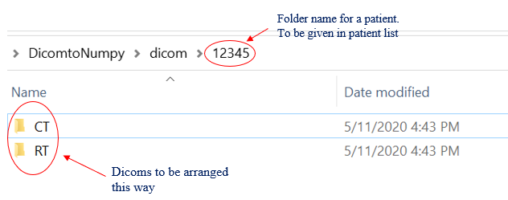

# Dicom-to-numpy-conversion
Dicom to numpy conversion

## config_dicomtonumpy: File locations, patient list, alias list

•	numpy_dst_dir : The destination for the numpy files

•	data_dir: Location of dicom files. For each patient, files have to be arranged into CT and RT. 

•	pat_list: The list of patients. This should be the folder name for each patient. Could be MRNs.

•	alias_list: This is the name you would like to give each patient for the numpy file. This will be the patient identifier. If the names in the patient list suffice, copy the    same for alias_list. For eg, MRN 12345 could be 1, the next MRN could be 2. However you would like to name it.

## dicom2numpy.py
After editing the config file, the dicom2numpy.py can be run. 

Each institution has different naming conventions for Rectum, Bladder and CTV. Please check to make sure correct structures are selected. The current keywords used in the code can be seen from lines 227-234. Edit these keywords to your convenience.

In this code,
Bladder would be named ROI_X_0_5.npy where X is the patient identifier from the alias list.
Rectum would be named ROI_X_0_4.npy where X is the patient identifier from the alias list.
CTV would be named ROI_X_0_7.npy where X is the patient identifier from the alias list.

If you would prefer a different way of saving, it can be changed within the code.

## Citing
If you find this repository useful, please consider citing it using a link to the repo :)
 

